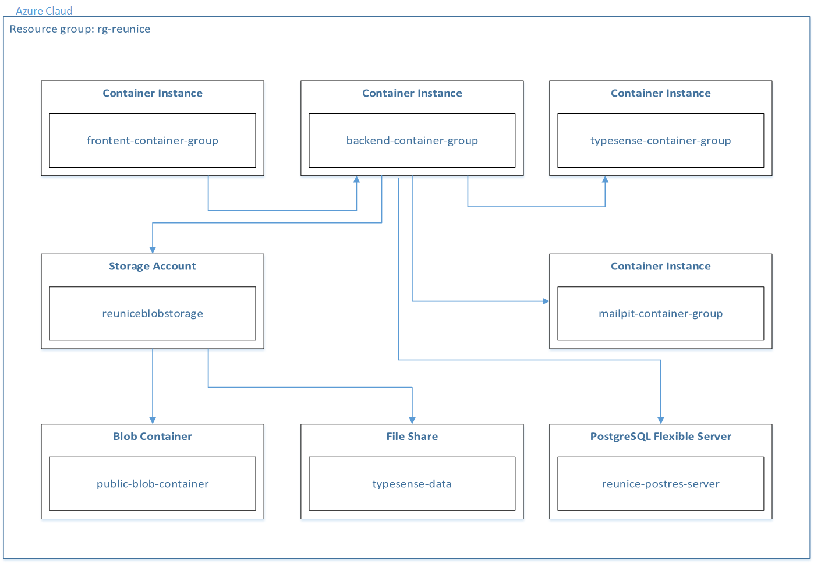

# EUNICE Platform on azure

This project is a fork of REUNICE CMS prototype, that adds support for running REUNICE CMS on Azure cloud.

## About 
EUNICE Platform is a content management system (CMS) designed for building and maintaining university websites. It supports multiple user roles—anonymous visitors, university users, administrators, and system admins—with increasing levels of control and access.

It allows users to:
- Browse and search university pages and resources
- Manage content with a WYSIWYG editor
- Upload and link resources (files or external links)
- Handle contact inquiries via a built-in messaging system
- Create and manage universities, users, templates, and backups
- Use role-based admin panels to control content, users, and submissions
- Deploy easily using Azure Cloud

Detailed user manual is available [here](./user_manual.pdf)

[Original project](https://github.com/AdrianKokot/put-reunice-platform)

## Running terraform

```bash
cd terraform
terraform init
terraform apply -var="subscription_id=your-subscription-id"
```

After a successful deployment, you can find `.env` file in the `terraform` directory. This file contains all the necessary environment variables for running the application locally or in Docker that need to be added to main `.env` file to connect to Azure resources.

## Code formatting

### Java

```bash
mvn spotless:apply # format code
mvn spotless:check # check if code is formatted
```

### TypeScript

```bash
npm run fix # format code and run eslint fix
```

## Running tests

### Java unit tests

```bash
mvn test
```

### Angular unit tests

```bash
npm run test
```

### Cypress end-to-end tests

```bash
npm run e2e
```

## Docker

### Run the application, rebuilding all images from source code
`docker compose up -d --build`

### Run the application using already built images
`docker compose up -d`

### Stop the application, but leave Docker Volumes intact
`docker compose down`

### Run only the backend service in container, frontend locally
```bash
docker compose up -d backend
cd frontend
npm install
npm start
```

### Running services

| URL | Service | Container |
| --- | --- | --- |
| localhost:8080 | spring-boot | backend |
| localhost:80 | nginx | frontend |
| localhost:8025 | mailpit ui | mailpit |
| localhost:1025 | mailpit smtp server | mailpit |
| localhost:5432 | postgres | postgres |
| localhost:8108 | typesense | typesense |

### Configure the application
Please read the instructions in the `.env.example` file (located in the main project directory). Copy the file and name it `.env`. Adjust all configuration variables in that file. When first deploying the application using `docker-compose`, the variable `DATABASE_SCHEMA_HANDLING_ON_STARTUP` should be set to `create`. Once deployed, the value should be changed to `validate` or `update`. Details can be found in the comments available in `.env.example` file.

## Architecture Diagram
Below is the architecture diagram that illustrates the structure and components of the Reunice application deployed on Microsoft Azure.

